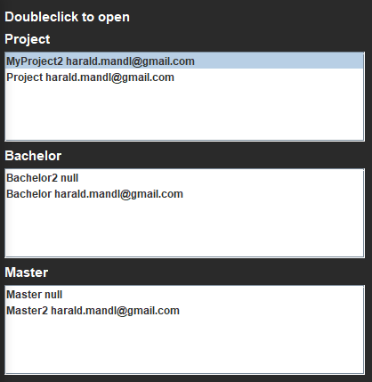
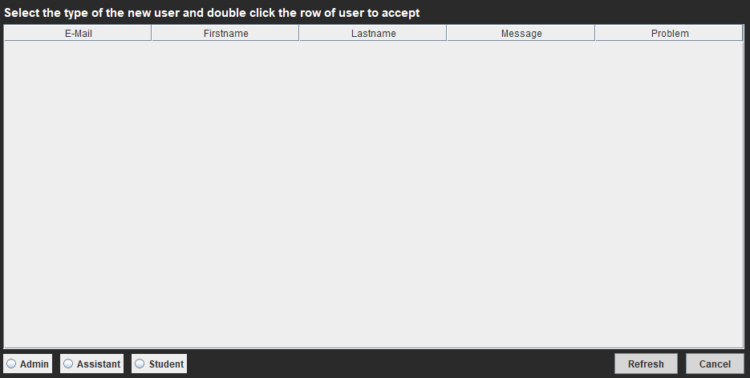

# Übung 8 Projekt "ISUPERVISION"

***

ISupervision is a management program which allows you to manage projects, bachelor theses and master theses of students.

## Installation

***

### Database

You can find the database model here: [Database](supervision.sql) (./supervision.sql)  
A few test values have already been inserted into this model!

For testing with xampp

1. Start Apache and MySQL
2. Create a new Database and name it supervision
3. Click the Import button in the top tab
4. Click the button "Choose a file" and select the [Database](supervision.sql) file.
5. Press ok button at the bottom of the page

**Info: an error message could appear. But as long as the database was inserted successfully, this shouldn't be a problem**

### Program

1. Create a new Maven Project
2. Import the project or replace the src directory with the attached [src](src) directory.
3. Add the configuration files you can find them in the [resources](resources) directory. ([hibernate](resources/hibernate.cfg.xml.template) and [log4j](resources/log4j2.xml.template))
4. Also replace the pom.xml file with the new [pom.xml](resources/pom.xml)
5. Go into the Project Structure and add the [hibernat directory](src/main/resources/hibernat) to the libraries.
6. Select now the Class [at.FH.General.Application.java](src/main/java/at/FH/General/Application.java) as start Point
7. when the database is running you can start the program

## User Roles

***

Three types of users are defined: Student, Assistant and Admin

### Student  

1. Can enroll in projects, bachelor- and master thesis.   
2. Bachelor thesis can only be enrolled when the student has a positive marked project   
3. Master thesis can only be enrolled when the student has a positive marked bachelor thesis   
4. Can always work on projects as long as he doesn't have any open projects to evaluate    
5. Can change his personal information 

### Assistant

1. create new projects, bachelor- and master thesis.   
2. determine how many tasks he wants to supervise.   
3. Can revise assignment.
4. Can delete assignment as long as no student has enrolled in that assignment.

### Admin

1. Create new projects, bachelor and master theses and determine who should supervise them.
2. Can verify new members.

## Functionality

**More information about task:**   
Doubleclick an entry to see more information about it 

**new Member:**   
Select on the bottom the role the user should have and then doubleclick the row of the user. (Don't forget to refresh) 

**add task**  
You will not gain a message that your project got added
The Reason for this is that you are able to add multiple tasks without interruption.

## Problem

If there are any problems with the installation than you can download the whole project
on this github link